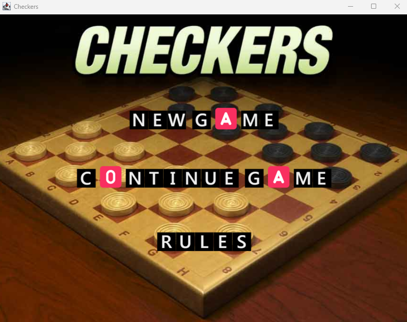
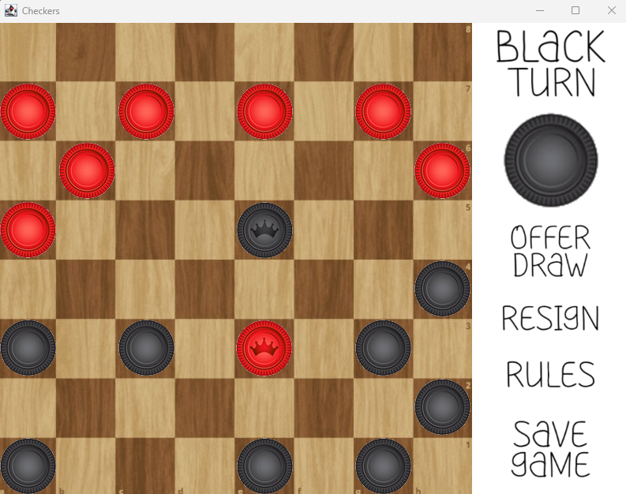

# Checkers from Scratch!

  

## Features

- Standard American Checkers rules
- Piece moves, forced captures, king promotions
- Resignation and draw offers
- Save games in savedGame.txt
- GUI built with Java Swing and `.png` assets

---

## Requirements

- **Java Development Kit (JDK) 8** or newer  
  [Download JDK](https://www.oracle.com/java/technologies/javase/javase-jdk8-downloads.html) or use [OpenJDK](https://adoptium.net/temurin/releases/)

- **Git** (to clone the repo)  
  [Download Git](https://git-scm.com/downloads)

- Java IDE or a terminal

---

## Getting Started

### 1. Clone the Repository

```bash
git clone https://github.com/jackeyemean/checkers.git
cd checkers
```

### 2. Compile & Run via Command Line

```bash
javac -d bin -sourcepath src src/Checkers.java
java -cp bin Checkers
```

> If images fail to load, verify that the `images/` folder is alongside `bin/` in the same directory.

## Project Structure

```
checkers/
├── images/                         # All images
│   ├── blackPawn.png
│   ├── blackKing.png
│   ├── redPawn.png
│   ├── redKing.png
│   └── board.png
├── src/
│   ├── controller/                 # Handles input & updates model
│   │   └── GameController.java
│   ├── model/                      # Core game logic and state
│   │   └── GameModel.java
│   ├── util/                       # Image loading, save/load
│   │   ├── ImageLoader.java
│   │   └── SaveLoadManager.java
│   ├── view/                       # GUI classes
│   │   ├── BoardPanel.java
│   ├── Checkers.java               # Entry point
├── savedGame.txt                   # Last saved game
├── gameSaved.txt                   # Stores boolean variable
├── README.md
└── .gitignore
```
